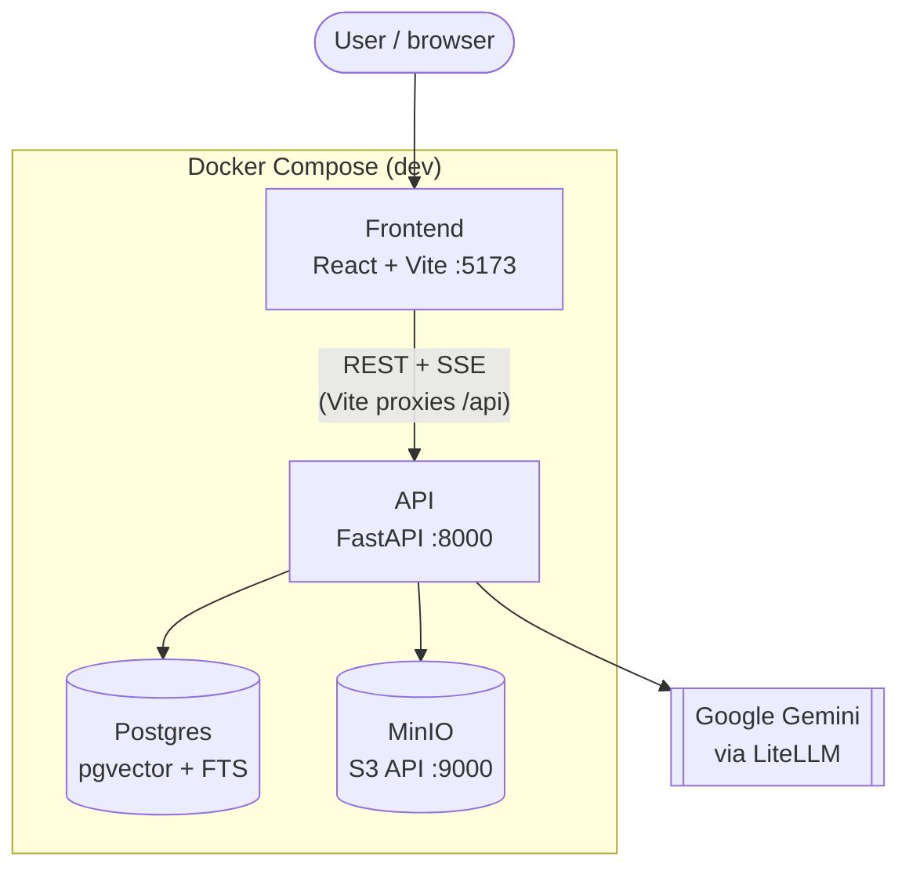
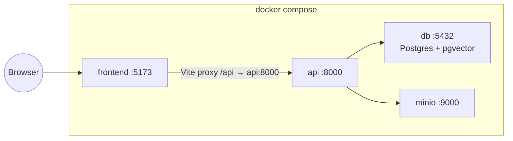
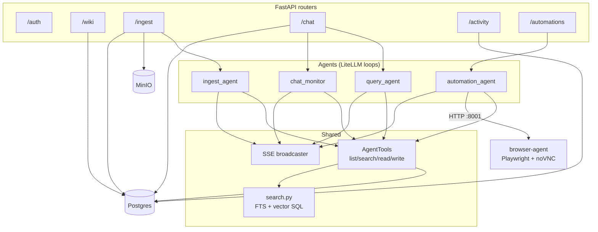
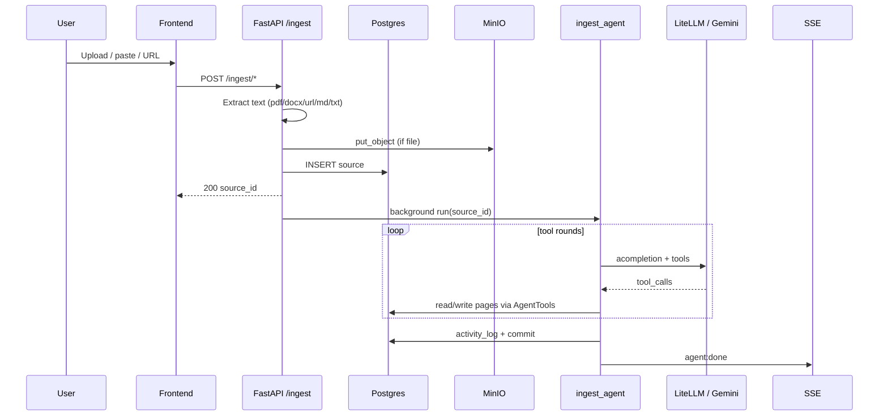
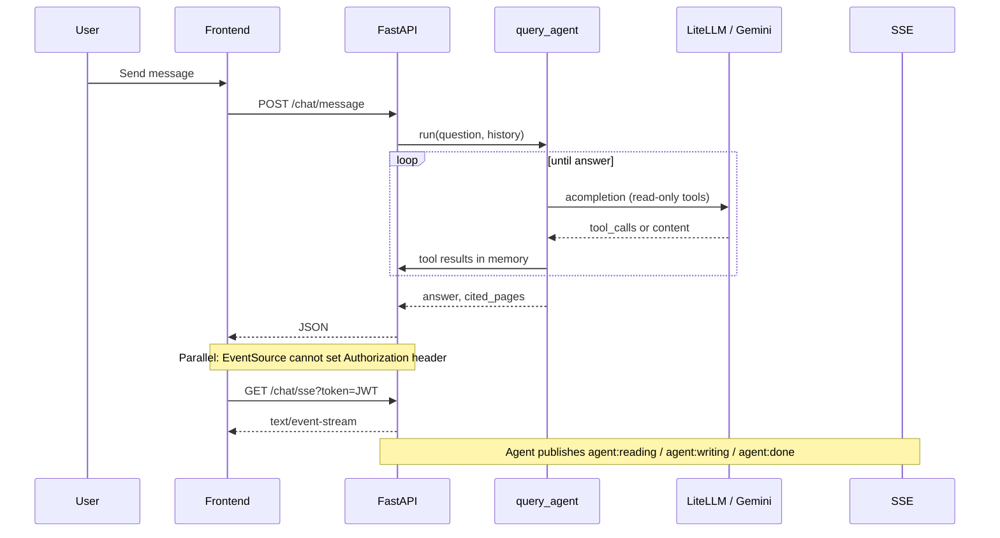

# LLM Wiki v0 — Architecture

This document describes what is **running in this repository** and how pieces connect. It complements the [design spec](../.agents/superpowers/plans/2026-04-28-llm-wiki-v0-design.md).

---

## 1. System context (dev)

---

## 2. Compose services (development)

Volumes: Postgres data and MinIO data persist in named volumes until removed.

---

## 3. Backend modules (logical)

Background work: ingest and chat monitor are triggered from route handlers (e.g. FastAPI `BackgroundTasks`) after rows are committed.

---

## 4. Ingest pipeline

---

## 5. Chat + SSE

---

## 6. Data stores (conceptual)

| Store | Contents |
|-------|-----------|
| **Postgres** | Workspaces, pages, revisions, `page_links`, sources, activity_log, chat sessions/messages; generated `tsv` on pages; optional `embedding` (1536-d) for hybrid search |
| **MinIO** | Raw binaries for file ingests (PDF, DOCX, etc.) |
| **Env** | `GEMINI_API_KEY`, `LITELLM_MODEL`, JWT and S3 settings — see `.env.example` |

---

## 7. Known integration notes

- **Gemini + tool history:** Assistant turns with **empty** JSON tool arguments (`{}`) used to break LiteLLM’s Gemini serializer on the *next* request. This repo normalizes those payloads in `api/app/agents/assistant_message.py` and pins a **newer LiteLLM** than the original plan where practical — see `api/requirements.txt`.
- **Pytest in Docker:** `tests/` is bind-mounted into the API container; `tests/conftest.py` forces test DB URL and credentials so a host `.env` does not break CI-style runs.

---

## 8. Automations (browser agent)

LLM-driven browser control with live noVNC and run recordings. **Full write-up:** [automation-agent.md](automation-agent.md).

---

## 9. Production

Use `docker-compose.prod.yml` (API + DB + MinIO + **browser-agent** + nginx-built frontend). Ensure `.env` includes Postgres init variables if the DB volume is new. Build: `docker compose -f docker-compose.prod.yml build`.

Pi: build `browser-agent` with `--build-arg ARCH=arm64` when using `CHROMIUM_EXECUTABLE_PATH=/usr/bin/chromium-browser` — see [automation-agent.md](automation-agent.md).
