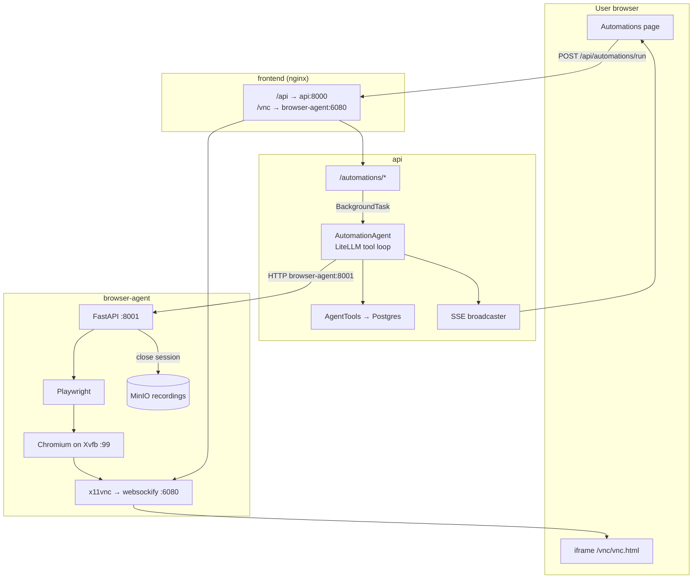
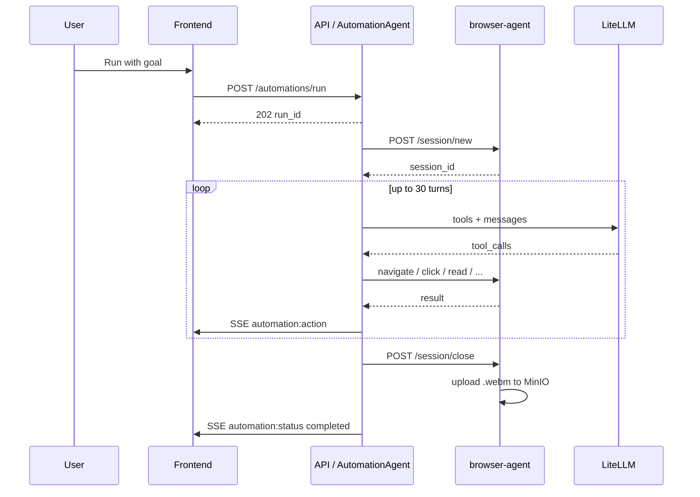

# Automation agent — architecture

How the **Automations** feature controls a real browser, streams a live view to the UI, and saves run history and recordings.

**Related:** [design spec](../.agents/superpowers/specs/2026-05-18-automation-agent-design.md) · [implementation plan](../.agents/superpowers/plans/2026-05-18-automation-agent.md)

---

## Mental model

**You** watch a live stream of a virtual desktop (noVNC). **The LLM** in the API container remote-controls Chromium on that desktop via HTTP to `browser-agent`, and can also read/write wiki pages with the same tool loop.

The API never launches Chromium directly — only the `browser-agent` service does.

---

## System diagram (production)



### Two network paths out of `browser-agent`

| Path | Consumer | Address |
|------|----------|---------|
| **Tool API** | `api` container only | `http://browser-agent:8001` (Docker internal) |
| **Live view (noVNC)** | User's browser | `https://<site>/vnc/...` (nginx proxies to `:6080`) |

The iframe loads in **your** browser, not inside the API container. That is why noVNC is proxied on the same HTTPS origin as the app (`/vnc/` in `frontend/nginx.conf`), not exposed as raw `http://host:6080` (mixed content on HTTPS sites).

---

## Container: `browser-agent`

**Location:** `browser-agent/` at repo root.

**Processes** (`start.sh`):

| Process | Role |
|---------|------|
| **Xvfb** `:99` | Virtual monitor 1280×800×24 |
| **Chromium** (`headless=False`) | Draws into Xvfb; Playwright drives it |
| **x11vnc** + **websockify** `:6080` | noVNC WebSocket + static UI |
| **uvicorn** `:8001` | HTTP tool API |

**Session lifecycle** (`browser-agent/main.py`):

1. `POST /session/new` — launch Chromium, `record_video_dir`, return `session_id`
2. `POST /session/{id}/navigate|click|type|scroll|extract|screenshot` — Playwright on that page
3. `POST /session/{id}/close` — stop recording, upload `.webm` to MinIO (`automation-recordings/{id}.webm`)

Sessions are held in an in-memory dict (single-user; one active automation at a time enforced by the API).

**Chromium on Pi (ARM64):** Either:

- Build with `docker compose build --build-arg ARCH=arm64 browser-agent` and set `CHROMIUM_EXECUTABLE_PATH=/usr/bin/chromium-browser` in `.env`, **or**
- Omit `CHROMIUM_EXECUTABLE_PATH` and use Playwright’s bundled ARM64 Chromium (default x86 dev build).

If `CHROMIUM_EXECUTABLE_PATH` points at a binary that is not in the image, `POST /session/new` returns 500 and the run fails immediately.

---

## API: routes and agent

### Start a run

```text
POST /automations/run  →  202 { run_id, status: "running" }
```

- Creates `AutomationRun` in Postgres
- Starts `AutomationAgent.run()` via FastAPI `BackgroundTasks`
- **409** if another run is `running` or `stopping` (one shared Xvfb display)

### `AutomationAgent` (`api/app/agents/automation_agent.py`)

Same pattern as `query_agent.py`: LiteLLM tool loop, up to 30 turns.

1. `POST http://browser-agent:8001/session/new` → `browser_session_id`
2. Each turn: `litellm.acompletion` with **browser tools** + **wiki tools** (`AgentTools`)
3. Tool calls → `_dispatch` → HTTP to `browser-agent`, results back to the model
4. Between turns: reload run `status` from DB (supports **Stop** via `stopping`)
5. `finally`: `POST .../session/close`, update run row, publish `automation:status` on SSE

**Browser tools (HTTP wrappers):**

| LLM tool | browser-agent endpoint |
|----------|------------------------|
| `browser_navigate(url)` | `POST /session/{id}/navigate` |
| `browser_click(selector)` | `POST /session/{id}/click` |
| `browser_type(text)` | `POST /session/{id}/type` |
| `browser_scroll(direction, amount?)` | `POST /session/{id}/scroll` |
| `browser_read()` | `POST /session/{id}/extract` (page text, capped) |
| `browser_screenshot()` | `POST /session/{id}/screenshot` (base64 PNG) |

**Wiki tools:** `list_pages`, `search_pages`, `read_page`, `write_page`, `create_page`, `append_to_page` — same `AgentTools` as ingest/chat.

The model usually reasons from **text** (`browser_read`); screenshots are optional.

### SSE events

| Event | Payload |
|-------|---------|
| `automation:action` | `run_id`, `type`, `detail` |
| `automation:status` | `run_id`, `status` |
| `automation:screenshot` | `run_id`, `image_b64` |

### Other routes

| Route | Purpose |
|-------|---------|
| `GET /automations/runs` | History (stale `running`/`stopping` > 45 min auto-marked `failed`) |
| `GET /automations/runs/{id}` | Run + action log |
| `POST /automations/runs/{id}/stop` | Set `stopping`; agent exits on next turn |
| `GET /automations/novnc-url` | Iframe URL from `NOVNC_URL` config |
| `GET /automations/runs/{id}/recording` | Stream WebM from MinIO (auth required) |

---

## Frontend (`/automations`)

1. **Idle:** goal textarea, run history, **Watch** (authenticated blob fetch — not `window.open`, which cannot send Bearer tokens).
2. **Running:** three panels — goal, noVNC iframe (`GET /automations/novnc-url`), live action feed via SSE.
3. On load: if a run is still `running`/`stopping`, reconnect to the running UI.
4. History: **Force stop** for stuck active runs.

---

## Configuration

### API (`api` service / `.env`)

| Variable | Default (compose) | Purpose |
|----------|-------------------|---------|
| `BROWSER_AGENT_URL` | `http://browser-agent:8001` | Tool API base URL |
| `NOVNC_URL` | `/vnc/vnc.html` | Path for iframe (proxied by nginx in prod) |
| `GEMINI_API_KEY` / `LITELLM_MODEL` | (existing) | LLM for the agent loop |
| `S3_*` | (existing) | Wiki + shared MinIO |

### `browser-agent` (prod compose maps from `S3_*`)

| Variable | Purpose |
|----------|---------|
| `MINIO_ENDPOINT` | `http://minio:9000` |
| `MINIO_ACCESS_KEY` / `MINIO_SECRET_KEY` | From `S3_ACCESS_KEY` / `S3_SECRET_KEY` |
| `S3_BUCKET` | Recording bucket |
| `CHROMIUM_EXECUTABLE_PATH` | Pi system Chromium only (see above) |
| `DISPLAY` | `:99` |

No extra `frontend/.env` vars for automations.

---

## End-to-end sequence



---

## Pi deployment notes

1. Deploy app stack after auth stack (see `CLAUDE.md`).
2. `scp` root `.env` and `frontend/.env` from Mac.
3. Build browser-agent for ARM64 if using system Chromium:
   ```bash
   docker compose -f docker-compose.prod.yml build --build-arg ARCH=arm64 browser-agent
   ```
4. Rebuild **frontend** when `nginx.conf` changes ( `/vnc/` proxy ).
5. Do not use `http://smoothstudy.ai:6080` for noVNC on HTTPS — use same-origin `/vnc/vnc.html`.

**Smoke test on Pi:**

```bash
curl -s http://localhost:8001/health
curl -s -X POST http://localhost:8001/session/new
# second command should return {"session_id":"..."} not 500
```

---

## Out of scope (v0)

- Logging into third-party sites
- Multiple concurrent automations
- Scheduled / cron runs
- Mobile-optimized Automations UI
